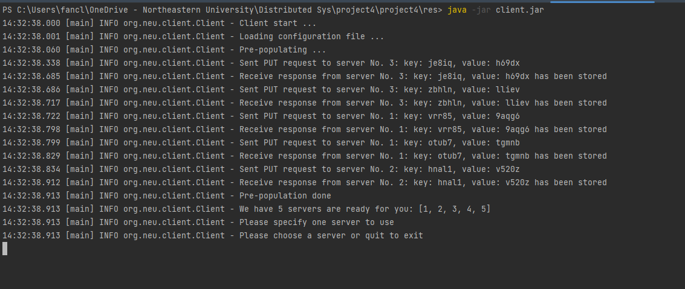

# Multi-threaded-Key-Value-Store-using-RPC-PAXOS

# Assignment Overview 
For this project, you will extend Project #3 by adding fault tolerance and achieving consensus of updates amongst 
replicated state machine KV-store servers using Paxos as described in in the Lamport paper, "Paxos made 
simple" that you will deploy and test on a small clustered system simulated per your convenience.   
1) In Project #3 you replicated your Key-Value Store Server from Project #2 across 5 distinct servers and 
used 2PC to ensure consistency across replicas on KV-store operations (minimally PUT & DELETE).   
However, as we've discussed in class two-phase commit protocols are not fault tolerant.  Your new goal 
for Project #4 is to integrate the capability to ensure continual operation of your KV-store despite replica 
failures.  To achieve this goal you will implement Paxos to realize fault-tolerant consensus amongst your 
replicated servers.  Functionally, you must implement and integrate the Paxos roles we described in class, 
and as described in the Lamport papers, including the Proposers, Acceptors, and Learners.  The goal here 
is to focus on the Paxos implementation and algorithmic steps involved in realizing consensus in event 
ordering. Client threads may generate requests to any of the replicas at any time.  To minimize the 
potential for live lock, you may choose to use leader election amongst the proposers, however, that is not 
a strict requirement of the project.  
2) A second requirement for this project is that the acceptors must be configured to "fail" at random times.  
Each of the roles within Paxos may be implemented at threads or processes - that's up to you to determine 
how to implement (I'd use threads).  Assuming you use threads for each role, at a minimum the acceptor 
threads should "fail" periodically, which could be done as simply as having a timeout that kills off the 
thread (or returns) after some random period of time.  A new acceptor thread could then be restarted after 
another delay which should resume the functions of the previous acceptor thread, even though it clearly 
won't have the same state as the previously killed thread.  Once this is completed, you may earn extra 
credit for the project if all roles are constructed to randomly fail and restart, but only the failure/restart of 
the acceptor is required.  This should make it clear how Paxos overcomes replicated server failures.   
 
As in project #1, you should use your client to pre-populate the Key-Value store with data and a set of keys.  The 
composition of the data is up to you in terms of what you want to store there.  Once the key-value store is 
populated, your client must do at least five of each operation: 5 PUTs, 5 GETs, 5 DELETEs.
# Evaluation
Your Paxos-based, fault-tolerant replicated multi-threaded Key-Value Store servers will be evaluated on how 
well they inter-operate with each other using RPC while doing concurrent operations on the UWT-provided 
“cluster” as well as their conformance to the requirements above.

# How to Run:

```java
// go to /res directory
cd res
// run five servers with different number
java -jar server.jar <serverNo.>   
// run client
java -jar client.jar
```


# Examples with description:

- A server started will have the below output:

  

- After five servers started, then a client starts with output:

  


# Assumption: 

Up to Level 3 crash recovery. Crash can be generated by input command on server's terminal. If a proposal will fail in phase 1, then client will get response timeout, then send the request to other proposers to retry. Acceptors failure will cause the Promise or Accept message cannot reach back to the proposer within limited time. Timeout at the proposer side, then the proposer will drop those messages from the timeout acceptors and continue to work. It will recover if the timeout will not be triggered. 

# Limitation:

Not standard implementation because of the proposer will send message to learners to commit value instead of acceptors.

# Citation: 

https://people.cs.rutgers.edu/~pxk/417/notes/paxos.html
